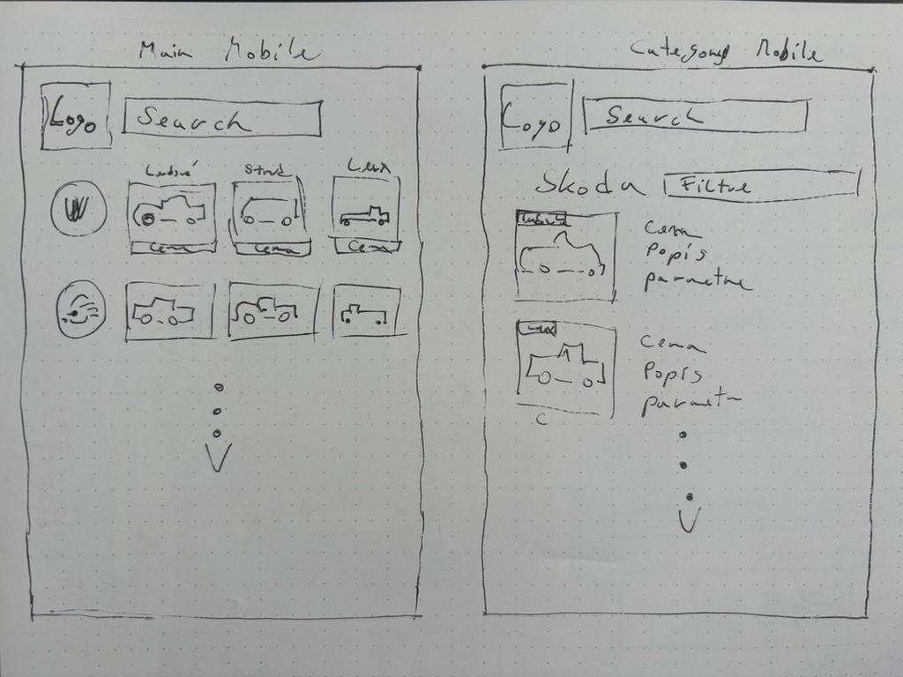
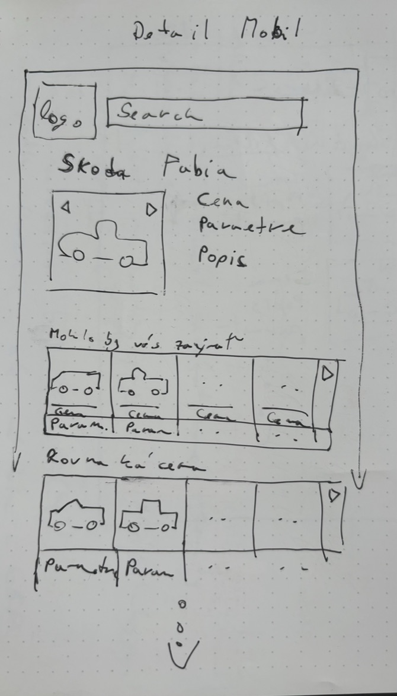
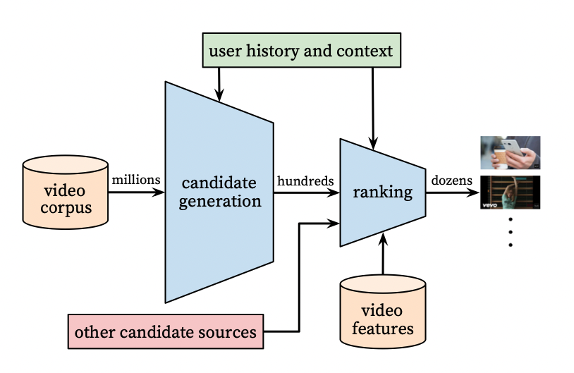
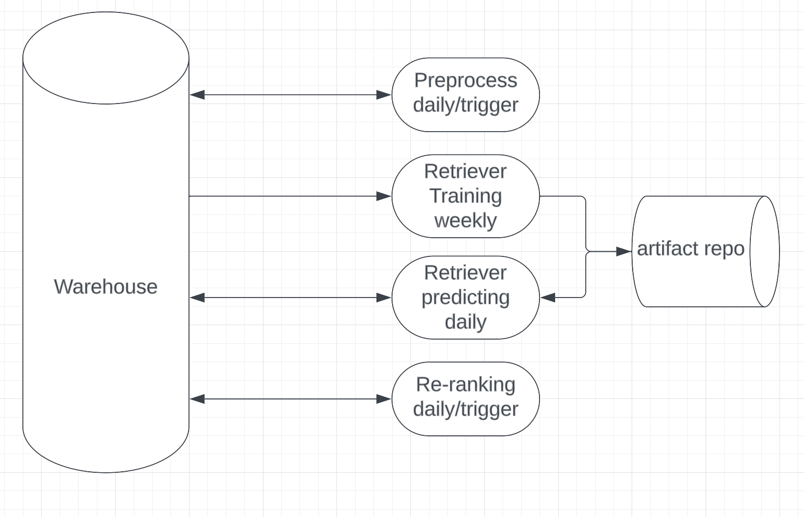

# Car recommender using public dataset

## Environment setup

To use this library/repo, make sure that you have Python >= `3.9.*` - we recommend using [pyenv][] for managing different
Python versions (see: [how to install pyenv on MacOS][]).

This project defines dependencies in [pyproject.toml](./pyproject.toml) according to [PEP-621](https://peps.python.org/pep-0621/)
For development create virtual env with:
```bash
python -m venv venv
source venv/bin/activate
```
Then run:
```bash
make install
```

## Front end

Suggested website wireframes for better intuition (please ignore my poor drawing skills):



__As simple as possible__, we are inundated with ads on every page, so I prefer simplicity in design. This means easy 
navigation on the web. You don't want the customer to get lost while searching for a product, nor should there be a 
dead end when traversing the web inspiringly. Various recommenders will be used for this. My vision is to have a website 
powered by customer behavior, but first, we need to __cold start it__. A side note: there should be an inspirational 
element, sometimes even a pseudo-random recommendation (not part of this repo).

### Main page

Only search and carousels sorted by the popularity of some basic character (for cars, I would guess manufacturers). 
To get started, I would choose the arrangement according to domestic manufacturers and continue with the most 
affordable ones (in CZ Škoda, VW, ...) or download data from the latest car sales census. On the main page, there would 
be an option to click on a product detail and an option to click on various category pages. I would divide the 
individual boxes in carousels into popular, golden middle, luxury. I'm not going to comment on Search, it's longer 
and is not the subject of the repo.

### Category page

For example, manufacturer, price category, etc.

### Product detail

A photo box of the item (vehicle) and other features. Below that, there would be other carousels for similar vehicles 
with a similar price, with similar features, and anything that makes sense to the customer. For example:
- Vehicles where he could get more for a small extra payment (higher performance, etc.). Here, in my opinion, it is important to be able to communicate to the customer what he is currently looking at. That is, it depends on the description of the carousel.
- Vehicles that look similar
- Same color (there are people who make decisions mainly based on color)

### Features

A UX feature that can increase value for users is __Smart search box__ (it's also a recommender) that will sort and 
standardize when searching. According to experience, this is the main point of entry, here I would suggest some 
contrastive learning driven by semantic neural search (I know it works). That is, someone writes: "a nice red car" -> 
throws out a list of options without manual navigation. Another one, **Compare tool**, builds a UX recommender so that 
the recommended vehicles are displayed next to each other so that they can be easily compared. At the same time, the 
vehicle on detail would be first.

A technical feature that might increase value for users is __Personalized recommenders__, not only to display what the 
user has already seen but to recommend the next step from the sessions, what he would like to see/buy (NLP).

### Technical aspect

It's hard to say what technologies to use for the mentioned project. It depends on the customer. I assume that he 
already has a website ready and running (lives) somewhere, so I would adapt to what he has. If it uses AWS, I would 
use its tools or tools that are well integrated. In the case of GCP, I know that Google has everything from artifact 
repo, through cloud storage, BigQuery, vertex AI, etc. Every technology has pros and cons; it is important to know 
about them. The reason why I would choose the whole package of the most preferred ones is clear; they will communicate 
more easily in all aspects.

## Software engineering

I wrapped the data in the flexible API and I chose the simplest way using flask. There are several options like django or 
fastapi, but for me the more familiar is flask. I implemented GET, PUT and DELETE which should be enough 
for this task. As I mentioned in code, data handling is done by pandas what is not the best way, but pandas methods
make my coding easier. Also I didnt added check if paths exist or DAOs.
Run api using:
```bash
python -m src.api.api
```
You can play or test api by [notebook](./notebooks/API_demo.ipynb).


## Data engineering / Data science (ML pipeline part)

The entire EDA is commented in the [jupyter notebook](notebooks/EDA.ipynb), along with the steps I took while exploring 
the data. At the end, there is a brief summary. Subsequently, I incorporated the findings into the data 
[pipeline](src/preprocess/preprocess_knn.py) for preparing the training sample. _Beware, this part is heavily tailored
to current dataset._

Maximizing profit is a highly open task. In the case of 1st party (AAAauto.cz), it may hold that selling more expensive 
vehicles leads to higher earnings (assuming a positive correlation between margin and price). This means that if 
I recommend slightly more expensive vehicles in the recommender, and the customer chooses to buy them instead of the 
initially viewed ones, I make a profit. Even though displaying pricier vehicles may reduce the overall conversion ratio 
(sell fewer cars, but earn more in total). On the other hand, in the case of a marketplace (mobile.de), their goal is 
to sell as many cars as possible and provide the best intermediary services. In this case, I would choose 
recommendations for the closest vehicles or even cheaper alternatives (selling cheaper cars sooner). Therefore, I will 
maximize the flow of users.

I choose the first option and assume a positive correlation between price and the resulting margin. Since I lack 
information about the customer's location, I won't sort based on physical proximity (this could be a significant 
selling point). I still miss some exact metric, this can be done by ABtest where you in A will recommend random cars 
and in B our recommender.

I choose universal architecture to make it easily adaptable to future changes in assignment. 
For example, if we need to sell a certain segment (red cars) during a specific period (Black Friday), we wouldn't want 
to build a new pipeline for a seasonal promotion. Over time, data about customer behavior (sessions, ranking, click 
rate, etc.) will be added, which can be utilized to deploy a dynamic model (some NNs).



Proven architecture as seen in the image (YouTube and others). First, I'll generate candidates from the model for 
each item; this number will be somewhat larger (e.g., 30). Then, I'll select a smaller or equal, specially ordered 
sample through reranking. This allows me to build X rerankers for each case, including, for example, a categorical page. 
Recommendation databases can grow rapidly, and this architecture allows storing candidates that can serve multiple 
carousels. This architecture enables us to have more models; for this case, we have static data that will serve as a 
starting point.

_The next step should involve collecting customer activity data. From sessions, we can build a "smarter" model. 
Without this data, we assume the role of "I know what the customer wants," which may not correspond to reality 
and customer needs. Website activity will show us how to build and arrange carousels._

### Candidate Generator (Retriever)

I could regress some target variable, such as price, and predict recommendations based on that. However, this would 
lead me down the path of "I know what determines similarity," and I would have to overhaul the entire pipeline in change 
of assignment. This is something I want to avoid. At the same time, I don't want to overwhelm anyone with neural 
networks (which is also an option and a suggestion for future development). For the task's purpose, I'll choose a 
simple method that calculates, for each item, the nearest neighbors based on all relevant parameters. This way, 
I guarantee candidates closest to each other based on the entire space matrix. 
[Link to script](src/retriever/knn.py)

### Re-ranker

We already have candidates based on some rough (mathematical) metric. However, this rough metric does not reflect the 
business model. So here, I would simply rearrange it based on price, as I don't have an exact success metric. 
Once I have it, I can easily adjust.
[Link to script](src/ranker/simple_max_profit.py)

Configs you can find [here](src/config) (already configured) and than run pipeline with 
script (Dont forget to run API first):
```bash
python -m scripts.create_max_profit_reco
```

Once you have run pipeline you can inspect your [recommendations in notebook](notebooks/Reco_demo.ipynb).

Side note:
Future for recommendation can be [generative AI][]. But present state-of-the-art are Two-Towers or Graph NNs (Pinterest).

## MLops and code structure

The ML architecture has already been outlined above.



I've written the configuration of the pipeline simply. What's missing is to verify whether the parameters have 
the correct format. This can be achieved using data classes or a dedicated package like Hydra.

The beauty of task division lies in the fact that each process can be encapsulated in a separate container and 
orchestrated as needed. For example, in the case of using the contrastive learning NN algorithm (computationally 
intensive for training), we can retrain weekly or monthly. Predicting new products, on the other hand, can run daily 
depending on how frequently they are added. The re-ranker can run more frequently, depending on the dynamism of the 
market for that commodity.

Certainly, Data Drift Monitoring needs to be addressed. Implement tools like TensorFlow Data Validation or Great 
Expectations to monitor data drift. These tools can help compare statistical properties of incoming data with the 
training data to identify potential shifts. DVC (Data Version Control) can help manage and track changes in your 
datasets and models over time. Of course, version control for models is crucial.

Use schema validation libraries or tools to ensure that the incoming data has the correct data types. This step can 
help catch potential issues early in the pipeline.

Implement robust logging to capture information about each run, including data statistics, model performance metrics, 
and any anomalies detected. Tools like Tableau or Kibana can be helpful for log analysis and visualization. I've 
already indicated some logs directly in the code, but, of course, that's not enough.

Set up an alerting system to notify the team when significant data drift or concept drift is detected. This ensures 
timely intervention and retraining if needed.

Last but not least, Establish a feedback loop where model performance metrics and insights from monitoring are used 
to continuously improve the pipeline and the models.

## DevOps / Infrastructure (this is realy general and abstract part)

I like to think in cloud systems, so below high-level outline of the architecture for a website recommendation 
system with separate parts for data preparation, retriever, and reranker.

First, Choose a cloud platform based on your team's expertise or any specific requirements. Common choices include AWS, 
Google Cloud Platform (GCP), or Microsoft Azure. Lets take Google.

Use a scalable and reliable data storage solution. Data Warehouse (BigQuery) for storing large scale structured data. 
Object Storage (Google Cloud Storage) for storing raw and processed data.

With data processing engine, process and transform raw data into features suitable for recommendation (retriever 
and ranker). Workflow Orchestration (Apache Airflow), schedule and manage the data preparation workflow. Of course 
monitor data shift and changes as was mentioned above.

Retriever and Reranker (training and prediction) some container orchestration (Kubernetes). Implement logging and 
monitoring for model performance and system health. 

Data collection and analysis using Google Analytics. Collect user interaction data. Set up and measure ABtests. 
Analyze feedback for continuous improvement.

For Deployment use CI/CD Pipeline (GitLab) to automate testing and deployment processes. Store and manage artifacts in 
Artifact Repository.

Last but not least, monitor and optimize costs. Extremely important part, to know if my recommender earn on himself.


For monitoring use a centralized metrics storage solution. Collect metrics, including:
- system metrics: CPU usage, memory usage, disk I/O.
- application metrics: Request/response times, error rates, throughput.
- infrastructure metrics: Container orchestration metrics (if applicable).
- define alert thresholds based on normal behavior and expected performance.
- implement anomaly detection to identify unusual patterns or deviations from the norm.


Logging:
- Use structured logging to standardize log formats across services.
- Aggregate logs from different services in a centralized log management system.
- Define and adhere to logging levels (info, warn, error, debug) for clarity.


Alerts:
- Set up an alerting system to notify the appropriate stakeholders when issues arise.
- Configure multiple alert channels, including email, Slack, and integrations with incident management systems.
- Define escalation policies to ensure alerts are appropriately addressed based on severity.
- Maybe create cookbooks for common issues, detailing steps to investigate and resolve problems.


[pyenv]: https://github.com/pyenv/pyenv#installationbrew
[how to install pyenv on MacOS]: https://jordanthomasg.medium.com/python-development-on-macos-with-pyenv-2509c694a808
[generative AI]: https://arxiv.org/abs/2305.05065